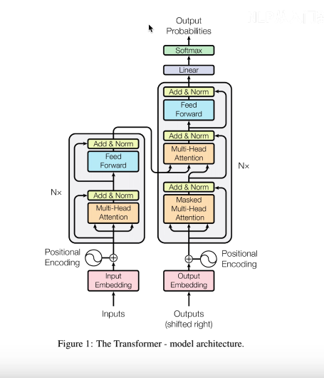
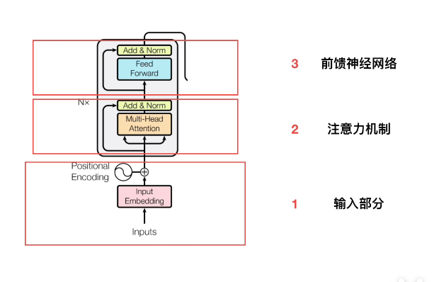
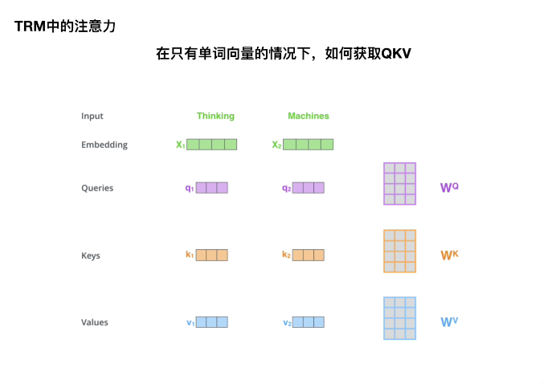
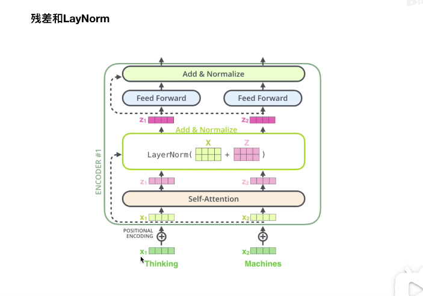
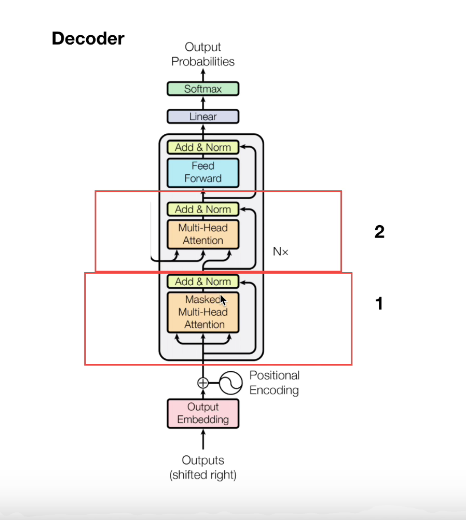

# Transformer
## 1.Encoder-Decoder
编码器-解码器
Encoders由n个结构上完全相同（参数上不是）的encoder组成，Decoders由n个结构上完全相同的decoder组成。

- transformer整体结构

### 1)Encoder-编码器

- 1.输入部分

1.1 Embedding

    word2vec
1.2 位置编码

    RNN的梯度消失和普通网络不太一样，它的梯度被近距离梯度主导，被远距离梯度忽略。
    transformer是并行处理，这样做增快了速度，但是忽略了单词之间的序列关系。因此需要位置编码。
- 2.注意力机制

2.1 基本的注意力机制

2.2 Transformer中的注意力

    其中W_q，W_k,W_v是可学习的参数。
-3 残差和LayNorm

### 2)Decoder-解码器

- 1.多头注意力机制

    Masked Multi-Head Attention
    需要对当前单词和之后的单词做mask

    Encoder生成K,V矩阵，Decoder生成的是Q矩阵